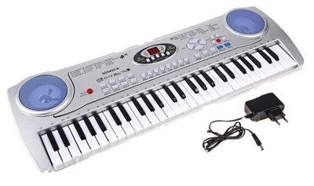
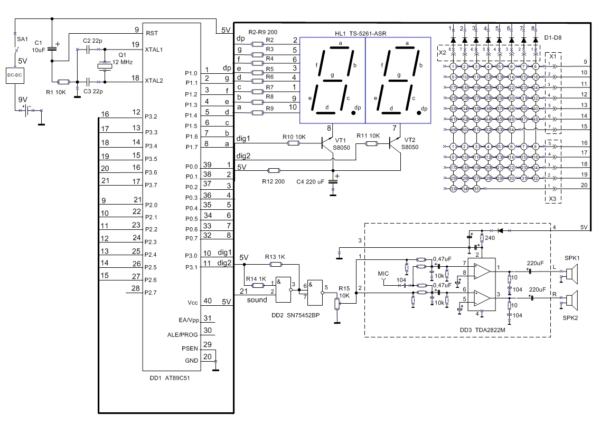
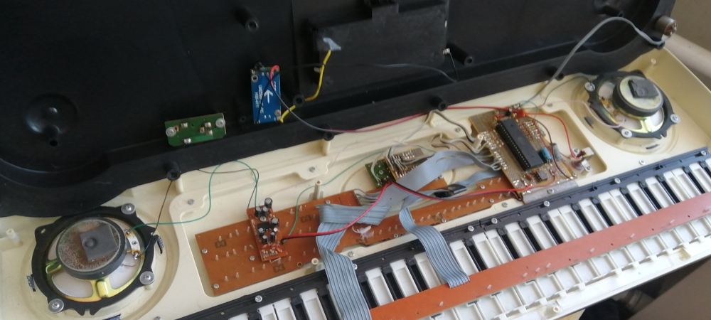
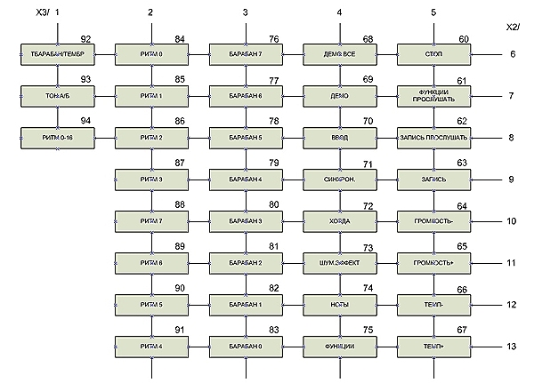

 ## Детское пианино-синтезатор

### Назначение
Если ваш синтезатор из детства вышел из строя, не спешите его выбрасывать. Возможно, данный проект по восстановлению детского пианино-синтезатора SD5490-A китайского производства поможет вернуть его к жизни. Эту музыкальную игрушку с 54-мя клавишами принес мне внук со словами: "Что мы можем с этим сделать?". Осмотр показал, что встроенный специализированный контроллер (черная таблетка) приказал долго жить.
 \
Конечно, о восстановлении прежнего функционала устройства говорить не приходится. Но попробовать оживить инструмент стоило.

### Новая схема
После удаления неисправного чипа и замены его на микроконтроллер Atmel A89C51 схема приняла следующий вид:
  
Из прежнего состава элементов в ней присутствуют: 7-сегментный дисплей HL1, двухканальный усилитель мощности DD3 с динамиками и матрица клавиатуры. В столбцы матрицы добавлены диоды D1-D8. Микроконтроллер DD1 имеет стандартную обвязку с кварцевым резонатором 12 МГц. Потенциометр R15 вместе с микросхемой DD2 обеспечивают регулировку громкости звука.

### Программа
Программа выполняет сканирование матрицы клавиатуры и воспроизводит соответствующую ноту в диапазоне от большой октавы до третьей октавы включительно (все 54 основные клавиши). \
7-сегментный дисплей отображает код нажатой клавиши. Используется динамическая индикация по прерыванию *int1*. Прямоуголные импульсы заданной звуковой частоты генерируются по прерыванию *int3*. \
Функциональные клавиши сканируются, но используются только для воспроизведения двух встроенных музыкальных фрагментов (см.текст программы) при нажатии клавиш *"ЗАПИСЬ ПРОСЛУШАТЬ"* и *"ДЕМО"*, соответственно. \
 \
Клавиши *"ТЕМП+"* и *"ТЕМП-"* позволяют изменять темп воспроизведения фрагмента. \
Для написания программы управления использовались язык программирования С и компилятор SDCC v.4.1.0. Исходный текст программы *src/midi.c* и файл прошивки *src/midi.bin* прилагаются. \
Для загрузки бинарного файла во Flash-память микроконтроллера применен программатор из моего проекта *Load_x51*.

